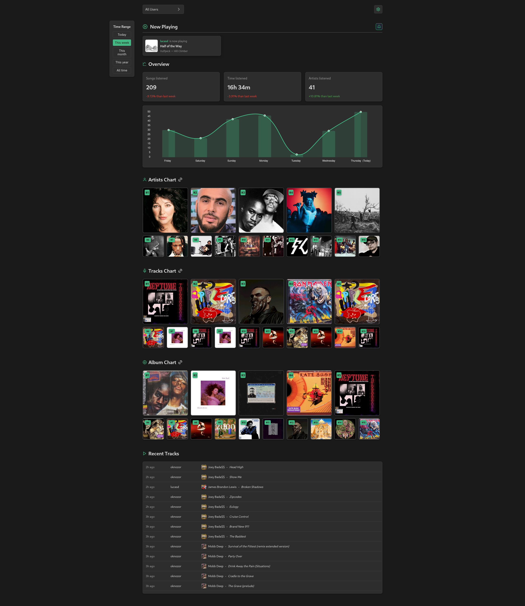

# The Elder Scrobz

## 🎵 About

The Elder Scrobz is a music tracking application that helps you monitor and analyze your listening habits. Inspired by
services like Last.fm, Maloja & Listen Brainz it allows you to "scrobble" (track) the music you listen to and provides
detailed statistics and insights about your music taste.

**This is a work in progress and not usable at the moment !**

## ✨ Features

- **Music Statistics Dashboard**: View comprehensive statistics about you and your friends' listening habits
- **Now Playing**: View in real time what your friends are listening
- **Artist & Album Details**: Explore detailed information about artists and albums you've listened to
- **Data Import**: Import your listening history from other services (Maloja, Last.FM, ListenBrainz)
- **Multi-User Support**: Manage multiple user profiles
- **MusicBrainz & Discogs Integration**: Enriched metadata from MusicBrainz & Discogs

## 🛠️ Technologies

- **Backend**: Rust with Axum web framework
- **Frontend**: Vue.js with TypeScript
- **Database**: PostgreSQL
- **API Documentation**: Swagger UI via Utoipa

## Running

The app is fully dockerized, you need to configure the following env vars :

| Variable                         | Description                                             | Example/Notes                                                    |
|----------------------------------|---------------------------------------------------------|------------------------------------------------------------------|
| `SCROBZ__port`                   | Port number for the application server                  | `3000`                                                           |
| `SCROBZ__coverart_path`          | Directory path for storing album cover art cache        | `"/.cache"`                                                      |
| `SCROBZ__database_url`           | PostgreSQL database connection URL                      | Should include username, password, host, port, and database name |
| `SCROBZ_OPENID_CLIENT_SECRET`    | OAuth2/OpenID Connect client secret                     | Used for user authentication                                     |
| `SCROBZ_OPENID_CLIENT_ID`        | OAuth2/OpenID Connect client ID                         | Used for user authentication                                     |
| `SCROBZ_OPENID_AUTHORITY`        | OAuth2/OpenID Connect provider authority URL            | The base URL of your identity provider                           |
| `SCROBZ__oauth_client_id`        | OAuth client ID (duplicate of OpenID client ID)         | Should match `SCROBZ_OPENID_CLIENT_ID`                           |
| `SCROBZ__oauth_client_secret`    | OAuth client secret (duplicate of OpenID client secret) | Should match `SCROBZ_OPENID_CLIENT_SECRET`                       |
| `SCROBZ__oauth_provider_url`     | OAuth provider URL (duplicate of OpenID authority)      | Should match `SCROBZ_OPENID_AUTHORITY`                           |
| `SCROBZ__navidrome_server_url`   | Backend API URL for Navidrome music server              | `https://music-api.${SECRET_DOMAIN}`                             |
| `SCROBZ__navidrome_frontend_url` | Frontend URL for Navidrome web interface                | `https://music.${SECRET_DOMAIN}`                                 |
| `SCROBZ__navidrome_username`     | Username for Navidrome authentication                   | Used to connect to Navidrome server                              |
| `SCROBZ__navidrome_password`     | Password for Navidrome authentication                   | Used to connect to Navidrome server                              |
| `SCROBZ__discogs_key`            | Discogs API consumer key                                | For music metadata enrichment                                    |
| `SCROBZ__discogs_secret`         | Discogs API consumer secret                             | For music metadata enrichment                                    |

In your music app, configure the Listen Brainz scrobble endpoint to the following :
`https://the-elder-scrobz.domain.example/api/v1`

## 🚀 Development

- (Optional) Install commit hooks:
    - `cargo install cocogitto`
    - `cog install-hook --all`
- Install sqlx-cli: `cargo install sqlx-cli`
- Start PostgreSQL: `docker compose up -d`
- Create the database: `slqx database create`
- Start the backend: `cargo run`
- Start the frontend: `cd frontend && npm run dev`
